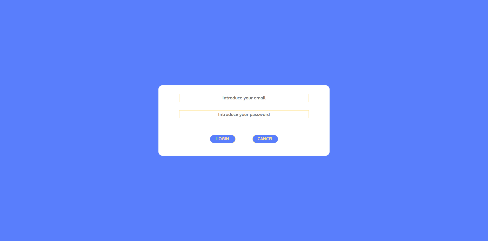

`#html` `#css` `#php` `#js` `#bootstrap`
# PHP File System

>In this project we have managed to make a file system. It has a login part with which you start the project and in which you have to log in to be able to access the file system.

>In the files part you have the possibility to search files and folders, create files/folders, delete them and rename them. 
You can also log out to log in with another user.

## Used Technology

* HTML
* CSS
* PHP
* JavaScript
* Bootstrap

## Project Demo

## Developers

[Alicia Cembranos](https://github.com/alicembranos).

[Julio Macias](https://github.com/juliomc23).

